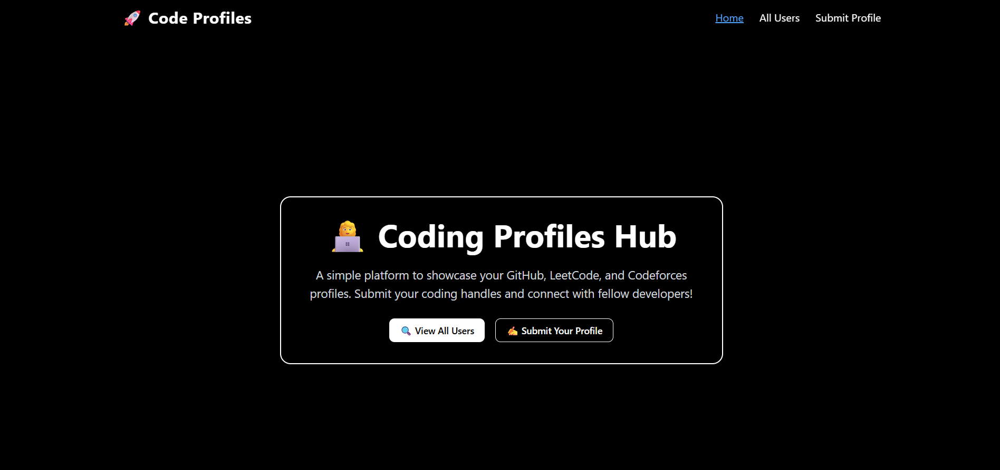

# 👥 Coding Profiles Tracker

A clean, minimal website to track and explore users' GitHub, LeetCode, and Codeforces profiles — built with **Next.js** and **Appwrite** as Backend-as-a-Service.

---

## 🚀 Features

- 📄 Submit a form with your:

  - Name
  - Email
  - GitHub Username
  - LeetCode Username
  - Codeforces Handle

- 🌐 Home Page:

  - Lists all users.
  - Clickable icons to visit their GitHub, LeetCode, and Codeforces profiles.

- 📦 Powered by **Appwrite** for storing and retrieving data.

---

## 🧱 Tech Stack

- ⚛️ [Next.js](https://nextjs.org/)
- 🎨 Tailwind CSS
- ☁️ [Appwrite](https://appwrite.io/) – Database and API
- 🔀 pnpm (optional) – for fast package installs

---

## 🖼️ Pages

| Route     | Description                   |
| --------- | ----------------------------- |
| `/`       | Landing page with CTA buttons |
| `/users`  | List of all submitted users   |
| `/submit` | Form to submit user profile   |

---

## 🛠️ Setup Instructions

1. **Clone the repo**

   ```bash
   git clone https://github.com/your-username/coding-social.git
   cd coding-social
   ```

2. **Install dependencies**

   ```bash
   pnpm install
   # or use npm / yarn if preferred
   ```

3. **Configure `.env.local`**
   Create a `.env.local` file in the root and add:

   ```env
   NEXT_PUBLIC_APPWRITE_ENDPOINT=your-appwrite-endpoint
   NEXT_PUBLIC_APPWRITE_PROJECT_ID=your-project-id
   NEXT_PUBLIC_DATABASE_ID=your-database-id
   NEXT_PUBLIC_COLLECTION_ID=your-collection-id
   ```

4. **Run the dev server**

   ```bash
   pnpm dev
   ```

5. **Open your browser**

   ```
   http://localhost:3000
   ```

---

## 🧑‍💻 Appwrite Setup (Basic)

1. Create an Appwrite project.
2. Create a database.
3. Add a collection with fields:

   - `name` (string)
   - `email` (email)
   - `github_id` (string)
   - `leetcode_id` (string)
   - `cf_id` (string)

4. Enable **Anonymous Access** or create **API keys** if needed.

---

## ✨ Credits

This project was created as a part of **Clueless Coders Club**.
Designed for juniors to practice using:

- Git + GitHub
- React/Next.js
- Appwrite or other BaaS
- Good UI practices

---

## 📸 Preview



---

## 📄 License

MIT — free to use for educational and personal purposes.
